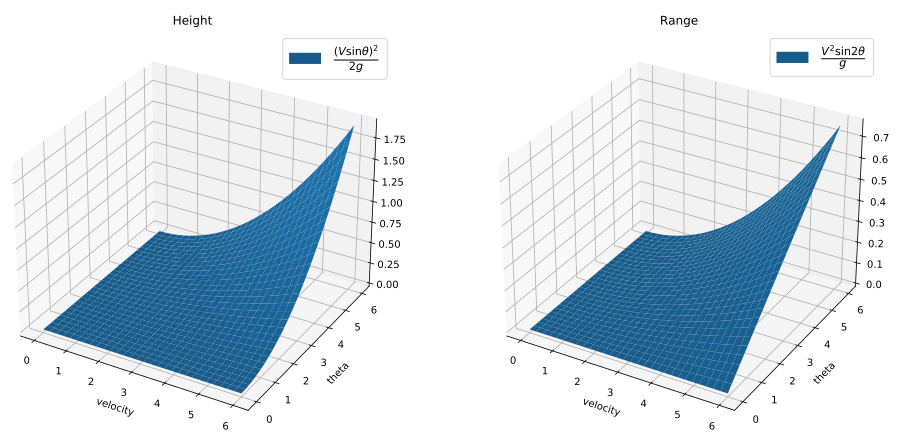
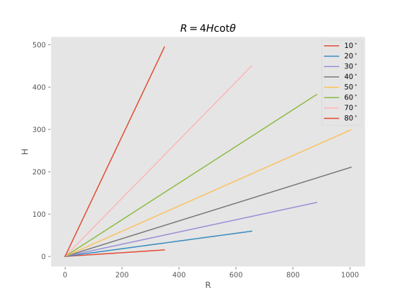

# README

## Introduction
In this project, we use neural networks to predict the highest height and the longest range during the projectile. We implement the neural networks with the PyTorch framework.

## Description
The input of the neural network is the initial velocity and angle. The output should be the height and the range. In a nutshell, the model should generate the samples follow the below plots.

    

## Visualization
Instead of using loss to evaluate the performance, we decide to use R-H plot to provide an alternative. The ground truth R-H plot is shown below:

    

## Model comparison
### a. Hidden features
| hidden_features |          Plot link          |
|:---------------:|:---------------------------:|
|       16        |   [plot](plot/fea_16.pdf)   |
|       32        |   [plot](plot/fea_32.pdf)   |
|       64        |   [plot](plot/fea_64.pdf)   |
|      1024       |  [plot](plot/fea_1024.pdf)  |

### b. Batch size
> We use 40960000 samples for training and set the hidden features to 32

| Batch size |  Epochs   |          Plot link          |
|:----------:|:---------:|:---------------------------:|
|     32     |  1280000  |   [plot](plot/bs_32.pdf)    |
|    4096    |   10000   |   [plot](plot/fea_32.pdf)   |

## TensorFlow
We also tested the model on TensorFlow with **batch size=4096, epoch=100**, and provide the colab notebook.

[See the plot](plot/tf_bs_4096.pdf)

